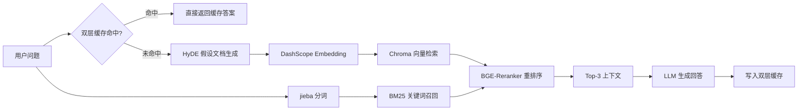
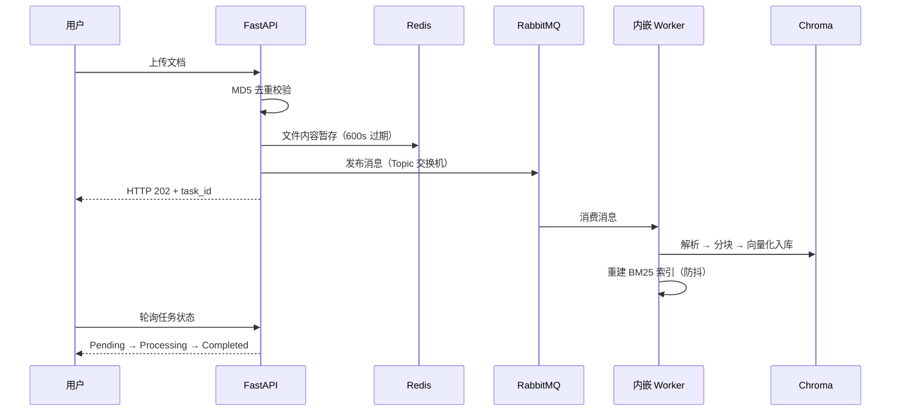

# 智能办公助手

基于 FastAPI + LangChain + Chroma + RabbitMQ + Redis 构建的企业级 AI 办公助手。具备知识库问答、报告生成、文件转换、邮件发送等能力——用自然语言驱动，完成从检索到交付的完整办公闭环。

---

## 📑 目录

- [项目背景](#-项目背景)
- [技术架构](#-技术架构)
- [核心亮点](#-核心亮点)
- [检索策略对比](#-检索策略对比)
- [项目结构](#-项目结构)
- [快速开始](#-快速开始)
- [Docker 一键部署](#-docker-一键部署)
- [常见问题](#-常见问题)
- [更新日志](#更新日志)

---

## ⭐ 项目背景

面向企业内部知识管理与办公自动化场景，提供文档检索问答、报告生成、格式转换、邮件发送等一站式 AI 办公能力。用自然语言驱动 Agent，完成从信息查询到文件交付的完整闭环。

## 🧱 技术架构

```
浏览器（HTML 单页前端） 
│ ▼ FastAPI 服务（单进程托管 API + 静态资源） 
├── JWT 认证 → SQLite 用户存储 
├── SSE 流式对话
│   ├── 🤖 Agent 智能体（主路径）─ create_tool_calling_agent + AgentExecutor
│   │   ├── search_knowledge_base ─ HyDE + 向量 + BM25 + Rerank 全流程检索
│   │   ├── upload_document ─ 文档内容异步入库（RabbitMQ）
│   │   ├── get_document_status ─ 知识库统计 + 关键词过滤
│   │   ├── generate_report ─ 检索 + LLM 汇总 → Markdown 报告
│   │   ├── convert_format ─ 报告格式转换（md/txt/docx）
│   │   └── send_email ─ SMTP 邮件发送 + 附件支持
│   └── RAG 链（备选路径）─ LCEL + RunnableWithMessageHistory
│       ├── HyDE 假设文档生成 
│       ├── Chroma 向量检索（DashScope Embedding） 
│       ├── BM25 关键词索引（jieba 分词） 
│       └── BGE-Reranker Cross-Encoder 重排序 
├── 双层缓存 
│ ├── MD5 精确匹配缓存（Redis） 
│ └── 语义相似度缓存（Faiss-like 内存向量） 
├── 文档异步上传 
│ ├── RabbitMQ Topic 交换机 
│ ├── 文件内容 Redis 暂存（600s 过期） 
│ └── 内嵌 Worker 异步消费 
└── 对话历史持久化（JSON 文件按用户/会话隔离）
```

> 前端为纯 HTML/CSS/JS 单页应用，由 FastAPI 直接托管，无需额外进程。

### 🔍 检索链路



### 📤 文档异步上传链路



## ✨ 核心亮点

- **多格式文档解析**：支持 PDF、Word(.docx)、Markdown、TXT 文件自动解析与向量化
- **Agent 自主决策**：6 个 Function Calling 工具，自动选择检索/上传/统计/报告生成/格式转换/邮件发送
- **报告生成 + 下载**：Agent 检索知识库 → LLM 汇总 → 保存 Markdown → SSE 推送下载按钮
- **文件格式转换**：支持 md → docx / txt / md 互转，Markdown 语法自动清洗
- **邮件发送**：SMTP 协议发送，支持正文 + 附件（QQ 邮箱 / 企业邮箱）
- **三阶混合检索**：**HyDE（假设文档嵌入）** 语义扩展 → **BM25 关键词召回** → **BGE-Reranker 重排序**，覆盖模糊语义与精确关键词两种场景
- **异步文档处理**：基于 RabbitMQ 消息队列的异步上传架构，文件内容临时存于 Redis，内嵌 Worker 后台消费，接口即时响应（HTTP 202）
- **上传任务追踪**：文档上传后通过 task_id 轮询处理状态（Pending → Processing → Completed/Failed）
- **文档 MD5 去重**：上传时自动检测内容 MD5，避免相同文档重复入库，同时重建 BM25 全量索引
- **双层热点缓存**：MD5 精确匹配（Redis）+ 语义相似度匹配（内存向量 LRU 上限 200 条），缓存命中时延迟从 ~20s 降至 ~0.01s
- **流式 SSE 响应**：服务端推送 + 前端打字机效果，Markdown 实时渲染（表格、代码块、标题、列表）
- **多轮对话记忆**：基于 LangChain `RunnableWithMessageHistory` + 自研文件持久化存储，支持会话隔离与历史回溯
- **多用户认证与隔离**：JWT 认证 + HTTP Bearer Token，用户数据完全物理隔离
- **会话管理**：新建、切换、重命名、删除会话，每个会话独立保持上下文
- **查询意图路由器**：三层漏斗路由（正则精确标记 → 语料 IDF 稀有词信号 → 默认语义），300 题评测下语义组 75.3% / 精确组 86.0% 正确分流，检索层 Recall@1 59.67% 反超全量混合基线 2pp
- **量化评估体系**：内置 Recall@K、MRR 自动化评测脚本与 300 条分类评测集（semantic/keyword 各 150），支持多种检索策略对比与路由阈值校准
- **纯 HTML 单页前端**：零依赖浏览器端渲染，由 FastAPI 内置托管，无需前端框架或额外进程

## 📊 检索策略对比（Top-1 召回率）

| 策略 | 纯模糊问题 (30) | 混合问题 (30模糊+13精确) |
|------|----------------|--------------------------|
| Baseline (向量) | 53.33% | 41.86% |
| HyDEOnly | 60.00% | 51.16% |
| HyDE + Rerank | **66.67%** | **48.84%** |
| HyDE + BM25 + Rerank | 50.00% | 39.53% |

> ⚡ 核心发现：HyDE+Rerank 在语义模糊场景下提升最显著。详细实验分析见 [`EVALUATION.md`](./EVALUATION.md)。

### 🧭 查询意图路由校准（300 条评测集，38 切片语料）

| 分组 | 路由判定正确率 | 说明 |
|------|--------------|------|
| 语义组（150 条） | 75.3% | CN_FACT_PATTERN 句式层将部分“为什么”句引入精确通道（双路为单路超集，检索层实测无损失） |
| 精确组（150 条） | 86.0% | 中文精确句式模板上线后大涨（60.67% → 86.00%） |

> 💡 路由器校准脚本 `app/eval_router.py`，评测集 `app/eval_questions.json`（type 标注 semantic/keyword）。分类正确率只是代理指标，最终收益以 Recall@K 对比为准——38 切片实测 adaptive 59.67% vs 全量混合 57.67%，详见 [`EVALUATION.md`](./EVALUATION.md) 实验三。

## 📂 项目结构

```
RAG_Personal/
├── main.py                          # 入口：FastAPI + 内嵌 Worker + 托管前端
├── app/
│   ├── api/                         # 接口层
│   │   ├── auth.py                  # 注册/登录
│   │   ├── chat.py                  # SSE 流式对话、会话管理
│   │   └── document.py              # 文档异步上传
│   ├── agent/                       # Agent 智能体
│   │   └── agent.py                 # Agent 定义 + 工具注册 + Prompt
│   ├── services/                    # 业务层
│   │   ├── tools/                   # Agent 工具集
│   │   │   ├── status_tool.py       # 知识库统计 + 报告生成 + 格式转换 + 邮件发送
│   │   │   ├── search_tool.py       # 知识库检索工具
│   │   │   └── upload_tool.py       # 文档上传工具
│   │   ├── llm.py                   # RAG 链（LCEL）
│   │   ├── hyde.py                  # HyDE 检索增强
│   │   ├── bm25_service.py          # BM25 关键词索引
│   │   ├── rerank.py                # BGE-Reranker 重排序
│   │   ├── vector_store.py          # Chroma 向量库
│   │   ├── history_service.py       # 对话历史持久化
│   │   ├── document.py              # 文件解析 + 校验
│   │   └── KnowledgeBase_md5_service.py  # MD5 去重 + 入库
│   ├── schemas/                     # Pydantic 模型
│   ├── config/settings.py           # 环境配置
│   ├── utils/                       # 工具模块
│   │   ├── auth.py                  # JWT + 密码哈希
│   │   ├── SQL_database.py          # SQLite 连接
│   │   ├── task_handler.py            # 公共文档处理 + BM25 防抖重建
│   │   ├── redis_client.py          # Redis 客户端
│   │   ├── rabbitmq.py              # RabbitMQ 客户端
│   │   ├── semantic_cache.py        # 语义缓存
│   │   └── task_status.py           # 任务追踪
│   ├── data/                         # 持久化数据
│   │   ├── storage/                  # ChromaDB + MD5 记录
│   │   ├── chat_history/             # 对话历史文件
│   │   └── report/                   # 生成的报告文件
│   ├── static/index.html            # HTML 前端
│   ├── eval_retrieval.py            # 检索评测（Recall@K / MRR）
│   ├── eval_router.py               # 路由器意图判定校准
│   ├── eval_questions.json          # 300 条分类评测集
│   └── worker.py                    # 独立 Worker（可选）
├── models/bge-reranker-base/        # Reranker 模型
├── requirements.txt
└── .env.example
```

## 🚀 快速开始

### 1. 环境准备

```bash
# 克隆项目
git clone <你的仓库地址>
cd RAG_Personal

# 创建虚拟环境
python -m venv .venv
# Windows
.venv\Scripts\activate
# macOS / Linux
source .venv/bin/activate

# 安装依赖
pip install -r requirements.txt
```

### 2. 下载模型

```bash
python download_models.py
```

### 3. 配置环境变量

复制 `.env.example` 为 `.env`，并填入你的 API Key：

```bash
cp .env.example .env
```

`.env` 文件内容示例：

```ini
SILICON_API_KEY=你的API_KEY
DASHSCOPE_API_KEY=你的API_KEY
SILICON_BASE_URL=https://api.deepseek.com
SILICON_MODEL=deepseek-chat

# 邮件发送（可选，使用邮件功能时需要）
SMTP_HOST=smtp.qq.com
SMTP_PORT=587
SMTP_USER=你的QQ号@qq.com
SMTP_PASSWORD=QQ邮箱授权码
```

### 4. 启动 Redis（使用缓存功能时需要）

**Windows（Docker）**：
```bash
docker run -d -p 6379:6379 redis
```

**macOS / Linux**：
```bash
redis-server
```

### 5. 运行项目

> ⚠️ **启动顺序**：先启动 RabbitMQ 和 Redis，再启动后端（`main.py`）。若首次启动时 RabbitMQ 不可用，异步上传功能会禁用且**不会自动恢复**——需重启后端服务。

```bash
# 一键启动（前端 + 后端同一进程，访问 http://127.0.0.1:8000）
python main.py

# 如端口被占用，指定其他端口
python -m uvicorn main:app --host 127.0.0.1 --port 9000
```

浏览器访问 `http://127.0.0.1:8000` 即可体验。

> **注意**：HTML 前端已内置于 FastAPI 中，无需额外启动 Streamlit。旧版 Streamlit 前端（`app/ui.py`）仍保留可用。

## 🐳 Docker 一键部署

不想手动装环境？一条命令拉起全套（Redis + RabbitMQ + Worker + API）：

```bash
# 1. 配置 API Key（必填）
cp .env.example .env   # 填入 SILICON_API_KEY / DASHSCOPE_API_KEY

# 2. 下载 Reranker 模型到 models/ 目录（首次需要，会被打包进镜像）
python download_models.py

# 3. 一键启动
docker compose up -d --build
```

| 服务 | 地址 |
|------|------|
| 🌐 应用前端 + API | http://localhost:8001 |
| 🐰 RabbitMQ 管理台 | http://localhost:15673（rag / rag123456） |
| 🗄️ Redis | localhost:6380 |

> 💡 说明：`docker-compose.yml` 已通过 `env_file` 注入你的 `.env`，API Key 无需重复配置；向量库、对话历史、报告文件均通过 volume 持久化到宿主机 `app/data/`，容器重建不丢数据。

## 🔧 常见问题

| 问题 | 解决方法 |
|------|---------|
| 端口 8000 被占用 | `netstat -ano \| findstr :8000` 查看 PID，`taskkill /F /PID <号>` 释放 |
| 页面加载不出来 | 确认已执行 `pip install aiofiles`，重启后端 |
| 重命名会话失败 | 需先发送一条消息创建会话文件，或刷新页面后重试 |
| RabbitMQ 连接失败 | 检查 vhost 用户权限是否为 `.*`（正则），不能只用 `*` |
| 上传功能禁用（日志提示） | RabbitMQ 首次连接失败后需**重启后端**才能启用；运维顺序应为先启动 RabbitMQ / Redis，再启动后端 |
| 文档上传后无响应 | 检查 RabbitMQ 是否运行，Redis 是否可连接（文件内容通过 Redis 传递） |
| Redis 连接失败 | 缓存功能自动降级，不影响核心问答；启动 Redis 后重启服务即可启用 |
| 邮件发送失败 | 检查 `.env` 中 SMTP 配置是否正确，QQ 邮箱需使用授权码而非登录密码 |
| 报告下载按钮不显示 | 确保 `app/data/report/` 目录存在，重启服务后自动创建 |

# 更新日志

格式基于 [Keep a Changelog](https://keepachangelog.com/zh-CN/1.0.0/)，版本号遵循 [语义化版本](https://semver.org/lang/zh-CN/)。

| 版本 | 日期         | 关键变更 |
|------|------------|---------|
| **1.8.1** | 2026-08-13 | 检索策略自适应二期：CN_FACT_PATTERN 中文精确句式 + adaptive_retrieve 全量接入（工具/LLM 双入口）+ RRF 融合；38 切片评测 adaptive 59.67% 反超全量混合基线 2pp；Embedding 统一工厂（text-embedding-v4 按量付费回切）；上传链路修复（失败重试不再必失败 + 死信队列声明） |
| **1.8.0-alpha** | 2026-08-04 | 检索策略自适应一期：BM25 服务单例化（修复索引空转 bug）+ 查询意图路由器（正则 + IDF 三层漏斗）+ 评测集扩至 300 条并支持 type 分组 + 路由校准脚本 |
| **1.7.0** | 2026-07-17 | 工程化加固：Agent 上传走消息队列、语义缓存 LRU 限制、BM25 防抖重建、CORS 拆分、空壳清理、检索全链路耗时日志、API 响应 Schema 补全 |
| **1.6.0** | 2026-07-15 | 智能办公助手：报告生成 + 格式转换 + 邮件发送 + 附件支持 |
| **1.5.0** | 2026-07-14 | Agent 升级：Function Calling 工具封装 + AgentExecutor 串联 + 多轮会话记忆 + DeepSeek 模型切换 |
| **1.4.0** | 2026-07-09 | 工程化加固 |
| **1.3.0** | 2026-06-28 | RabbitMQ 异步文档上传 + 任务状态追踪 + 语义相似度缓存 + 独立 Worker 进程；Redis 懒加载降级 |
| **1.2.0** | 2026-06-27 | HTML 单页前端替代 Streamlit；SSE 流式 + Markdown 渲染；BM25 关键词检索；MD5 去重；会话管理增强 |
| **1.1.0** | 2026-06-20 | HyDE 假设文档检索 + BGE-Reranker 重排序；JWT 多用户认证；多格式文档解析；LCEL 链式 RAG |
| **1.0.0** | 2026-06-15 | 项目初始化：FastAPI + LangChain + Chroma + DashScope；文档上传与问答；Recall@K/MRR 评测；Streamlit 原型 |

### 🗺️ 路线图

**近期计划：Agent 架构升级（AgentExecutor → LangGraph）**

> 现状：Agent 基于 `langchain_classic` 的 `AgentExecutor`（官方已标记为 legacy），存在三个局限：
> ① 流程只能靠 Prompt 软约束，无法强制"先检索后回答"；② 对话历史需手工拼接注入；③ 回答为整段返回，非真正的 token 级流式。

| 阶段 | 整改内容 | 预期收益 |
|------|---------|---------|
| 一期 | 引入 `langgraph`，用预置 `create_react_agent` 替换 `AgentExecutor`，复用现有 6 个工具与系统提示词 | 真·token 级流式输出，代码与 LangChain 官方主线对齐 |
| 一期 | 用 Checkpointer 接管多轮记忆（thread_id 按用户+会话隔离），与现有 JSON 历史文件双写过渡 | 告别手工拼接历史文本，多轮状态自动持久化 |
| 二期 | 自定义 StateGraph：将"必须先检索知识库"从 Prompt 规则升级为图结构硬约束（入口强制经过检索节点） | 检索流程由代码保证而非模型自觉，Prompt 大幅精简 |
| 二期 | 敏感操作人机协同：`send_email` 等工具执行前 interrupt 中断，等待用户确认后恢复执行 | 避免误发邮件，Agent 行为更可控 |

**近期计划：检索策略自适应（查询意图路由）**

> 现状：`search_knowledge_base` 固定走 HyDE + 向量 + BM25 + Rerank 全流程，但评测证明模糊语义场景下 BM25 反而拉低召回（Recall@1 53.3% → 50.0%，详见 EVALUATION.md）——根因是小语料 IDF 统计不可靠，且未区分查询类型。

**改造清单**（✅ 已完成 / ⏳ 进行中）：

| # | 文件 | 改造内容 | 状态 |
|---|------|---------|------|
| 0 | `app/services/bm25_service.py` + 5 处调用点 | BM25 单例化：模块级 `bm25_service` 统一索引，修复原先每次 new 实例导致索引空转的 bug | ✅ |
| 1 | `app/services/tools/query_router.py`（新增） | 查询意图路由器三层漏斗：正则精确标记（《》/引号/英文/版本号）→ 语料 IDF 稀有词信号 → 默认 semantic | ✅ |
| 1.5 | `app/eval_questions.json` + `app/eval_router.py`（新增） | 评测集扩至 300 条（semantic/keyword 各 150，type 字段标注）；路由校准脚本输出逐条 max_IDF 分布 | ✅ |
| 2 | `app/services/hyde.py` | 新增 `adaptive_retrieve` 路由入口：semantic → HyDE+Rerank 单路；keyword → 双路融合 + Rerank；新增 RRF（倒数排名融合）替代现有简单拼接去重 | ✅ |
| 3 | `app/services/tools/search_tool.py` | 检索接入点从 `hyde_plus_rerank_bm25_retrieve` 切换为 `adaptive_retrieve` | ✅ |
| 4 | `app/services/llm.py` | RAG 备选链同步切换，双路径质量对齐 | ✅ |
| 5 | `app/eval_retrieval.py` | 新增 `RouterStrategy` 评测策略，全量 300 条复跑对比 | ✅ |
| 6 | `EVALUATION.md` + README | 更新策略对比表与亮点描述（路由校准结果已记录至 EVALUATION.md） | ✅ |

**二期校准结论**（38 切片，300 条，见 EVALUATION.md 实验三）：语义组分类正确率 75.3%、精确组 86.0%（中文句式上线后 60.67% → 86.00%）；CN_FACT_PATTERN 将精确组丢分从 -7.29pp 收窄至 -2.19pp，检索层 Recall@1 59.67% 反超全量混合基线 2pp，验收通过。

**验收指标**：38 切片实测 adaptive_retrieve Recall@1 59.67% vs 全量混合 57.67%，反超 2pp；语义两组 +6.67pp/+5.83pp，精确组丢分仅剩 -2.19pp（3 题，均为中文句式变体）。

**远期计划**

| 方向 | 规划内容 | 预期收益 |
|------|---------|---------|
| 🤝 架构演进 | 多 Agent 协作：基于 LangGraph Supervisor 模式，拆分知识库 Agent（检索/统计/上传）与办公 Agent（报告/转换/邮件），由主管 Agent 统一调度 | 工具集解耦，单 Agent 提示词膨胀问题解决，具备横向扩展新角色的能力 |
| 🏭 业务延展 | 垂直领域模板化：将检索链路抽象为可配置底座（语料 + Prompt + 评测集三件套热替换），优先落地金融研报分析、法律合规审查等高价值场景 | 同一套技术底座覆盖多个业务域，从"工具"升级为"平台" |
| 📈 质量体系 | 评测规模化与在线监控：评测集扩展至 100+ 条、语料扩展至 50+ 篇，验证 BM25 在大规模语料下的增益；上线检索命中率、缓存命中率、全链路延迟监控面板 | 用数据驱动检索策略调优，优化效果可量化、可回归 |
| 🔍 查询理解 | ~~查询意图分类~~ 已提前至近期计划（见上方「检索策略自适应」改造清单） | 检索策略从"固定流水线"进化为"自适应路由" |

**近期工具扩展**

- 定时任务 `schedule_task`：支持"N 分钟后发邮件/生成报告"等延迟执行，基于 asyncio 内存级调度（方案 A 轻量版），后续按需升级 Redis 持久化
